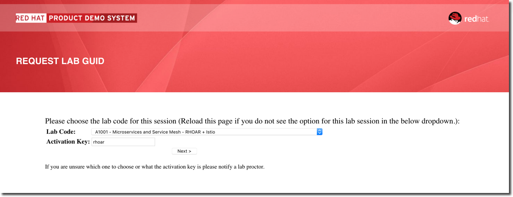

:noaudio:
:scrollbar:
:data-uri:
:toc2:
:linkattrs:

= Lab Setup

.Prerequisites
.. `ssh` utility installed on your laptop
.. Web browser installed on your laptop
.. broadband internet connectivity

:numbered:

== Overview

This first lab orients you with the course lab assets provided to you.

Your lab environment consists of the following:

. *Remote Virtual Machine*
+
Accessible via the ssh protocol.
It is pre-installed with _OpenShift Container Platform_ and _Istio_.

== Access Course VM via `GUID Grabber`

This section of the lab explains how to access the Red Hat Tech Exchange _GuidGrabber_ in order to obtain a GUID.
This GUID will be used to access the lab environment.

. Begin by going to http://bit.ly/rhte-guidgrabber
+

. From this page select the *Lab Code* :  _A1001_

. Enter the *Activation Key* provided by the lab instructor.

. Click *Next*.

. The resulting page will display your lab's GUID and other useful information about your lab environment.
+
image::images/00_setup_guid_grabber_response_page.png[GUID Grabber Response Page]

. Your remote virtual machine is accessible via the `ssh` protocol.
+
Follow the directions exactly as indicated in the Guid Grabber Information Page to ssh into your remote lab VM.

. When you are completely done with your lab environment at the end of this course, please click *Reset Workstation* so that you can move on to the next lab.
If you fail to do this, you will be locked into the GUID from the previous lab.
+
[NOTE]
Clicking *Reset Workstation* will not stop or delete the lab environment.

== Environment Variables

Once you've ssh'd into your remote terminal window, you'll want to set the following environment variables:

-----
#  Using the above variables, copy & paste the following in the same terminal #

echo "export LAB_CODE=a1001" >> ~/.bashrc
echo "export OCP_USERNAME=developer" >> ~/.bashrc
echo "export OCP_PASSWD=r3dh4t1\!" >> ~/.bashrc
echo "export OCP_REGION=`echo $HOSTNAME | cut -d'.' -f2`" >> ~/.bashrc
echo "export OCP_DOMAIN=clientvm.\$OCP_REGION.rhte.opentlc.com" >> ~/.bashrc
echo "export OCP_TUTORIAL_PROJECT=\$OCP_USERNAME-istio-tutorial" >> ~/.bashrc

source ~/.bashrc

-----

== OpenShift Container Platform

Your lab environment is built on Red Hat's OpenShift Container Platform.

Access to your OCP resources can be gained via both the `oc` utility as well as the OCP web console.

. Verify that OCP has started:
+
-----
sudo systemctl status oc-cluster
-----

* You should see
+
-----
 oc-cluster.service - OpenShift oc cluster up Service
   Loaded: loaded (/usr/lib/systemd/system/oc-cluster.service; enabled; vendor preset: disabled)
   Active: active (exited) since Thu 2018-09-06 02:04:56 UTC; 2 days ago
  Process: 21090 ExecStart=/bin/oc cluster up --base-dir=/var/lib/openshift --public-hostname=clientvm.7b13.rhte.opentlc.com --routing-suffix=apps.clientvm.7b13.rhte.opentlc.com --loglevel=1 (code=exited, status=0/SUCCESS)
 Main PID: 21090 (code=exited, status=0/SUCCESS)
    Tasks: 0
   Memory: 0B
   CGroup: /system.slice/oc-cluster.service

Sep 10 10:10:10 clientvm.eee0.rhte.opentlc.com occlusterup[21080]: Server Information ...
Sep 10 10:10:10 clientvm.eee0.rhte.opentlc.com occlusterup[21080]: OpenShift server started.
Sep 10 10:10:10 clientvm.eee0.rhte.opentlc.com occlusterup[21080]: The server is accessible via web console at:
Sep 10 10:10:10 clientvm.eee0.rhte.opentlc.com occlusterup[21080]: https://clientvm.eee0.rhte.opentlc.com:8443
Sep 10 10:10:10 clientvm.eee0.rhte.opentlc.com occlusterup[21080]: You are logged in as:
Sep 10 10:10:10 clientvm.eee0.rhte.opentlc.com occlusterup[21080]: User:     developer
Sep 10 10:10:10 clientvm.eee0.rhte.opentlc.com occlusterup[21080]: Password: <any value>
Sep 10 10:10:10 clientvm.eee0.rhte.opentlc.com occlusterup[21080]: To login as administrator:
Sep 10 10:10:10 clientvm.eee0.rhte.opentlc.com occlusterup[21080]: oc login -u system:admin
Sep 10 10:10:10 clientvm.eee0.rhte.opentlc.com systemd[1]: Started OpenShift oc cluster up Service.   
-----

. Using the `oc` utility, log into OpenShift
+
-----
oc login https://$HOSTNAME:8443 -u $OCP_USERNAME -p $OCP_PASSWD
-----

. Ensure that your `oc` client is the same minor release version as the server:
+
-----
oc version
-----

* You should see:
+
-----
oc v3.10.14
kubernetes v1.10.0+b81c8f8
features: Basic-Auth GSSAPI Kerberos SPNEGO

Server https://master.8091.openshift.opentlc.com:443
openshift v3.10.14
kubernetes v1.10.0+b81c8f8
-----

.. In the above example, notice that version of the `oc` client is of the same release as the remote OCP master API.
.. There a known subtle problems with using a version of the `oc` client that is different from your target OpenShift server.

. View existing projects:
+
-----
oc get projects
-----

* You should see:
+
-----
NAME                          DISPLAY NAME                  STATUS
developer-coolstore-catalog   developer-coolstore-catalog   Active
developer-coolstore-gateway   developer-coolstore-gateway   Active
istio-system                                                Active
myproject                     My Project                    Active
-----

* *istio-system*
+
Your OCP user has been provided with _view_ and _edit_ access to the central _istio-system_ namespace with all _control plane_ Istio functionality.
+
Later in this lab, you'll use a utility called _istioctl_ .
This utility will need both view and edit privileges to the _istio-system_ namespace.

== Clean up

The OpenShift environment currently has other project that we are not using. We'll remove them now.

. Clean up other projects. 
+
-----
oc delete all --all -n developer-coolstore-catalog
oc delete project developer-coolstore-catalog

oc delete all --all -n developer-coolstore-gateway
oc delete project developer-coolstore-gateway
-----

== Update Maven 

On the VMs, it has an older version of Maven 3.0.5.  The labs require Maven 3.5.x. Here are quick steps to update Maven for your VM.  

. Download Maven 
* _The `curl` command below should be entered all on one line_
+
----
curl http://mirror.cc.columbia.edu/pub/software/apache/maven/maven-3/3.5.4/binaries/apache-maven-3.5.4-bin.tar.gz | tar -xzf - -C ~/
----

. Update your Linux path
+
----
echo "PATH=$HOME/apache-maven-3.5.4/bin:$PATH" >> ~/.bashrc

source ~/.bashrc
----

. Verify Maven version
+
----
mvn -v
----

* You should see the updated Apache Maven version *3.5.4*:
+
----
Apache Maven 3.5.4 (1edded0938998edf8bf061f1ceb3cfdeccf443fe; 2018-06-17T18:33:14Z)
Maven home: /home/lab-user/apache-maven-3.5.4
...
----

== View OpenShift Web Console

. Log into OpenShift Web Console
.. Many OpenShift related tasks found in this lab can be completed in the Web Console (as an alternative to using the `oc` utility.
.. To access the OCP web console, point to your browser to the output of the following:
+
-----
echo -en "\n\nhttps://$OCP_DOMAIN:8443\n\n"
-----
+
NOTE: If your web browser prompts about `connection privacy / security`, select `Advanced` and continue.
+
.. Authenticate using the values of `developer` and `r3dh4t1!`

* You should see:
+
image::images/00_openshift-web-console-projects.png[OpenShift Web Projects]

== Congratulations!

In this lab you successfully completed the intial set up.

Proceed to the next lab: link:01_deploying_microservices_Lab.html[*01 - Deploying Microservices*]

== Appendix

=== Administrative Access

NOTE: This is for information only. You do not need to follow these steps.

. On your client VM, access to the `root` operating system user can be achieved by executing: `sudo -i`
. As the `root` operating system user, `cluster admin` access to your OCP environment can be achieved by executing :
+
-----
oc login -u system:admin
-----

. You can check the status of the OCP system service by executing:
+
-----
systemctl status oc-cluster.service
-----

. The OCP environment can be restarted as follows:
+
-----
systemctl restart oc-cluster.service
-----
