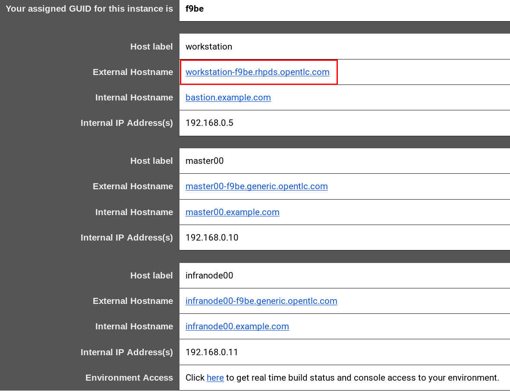

:noaudio:
:scrollbar:
:data-uri:
:toc2:
:linkattrs:

= Lab Setup

.Prerequisites
.. `ssh` utility installed on your laptop
.. Web browser installed on your laptop
.. broadband internet connectivity

:numbered:

== Course Virtual Machine

This first lab orients you with the course lab assets provided to you.

Your lab environment consists of a single remote virtual machine that is:

** Accessible via the ssh protocol.
** Pre-installed with _OpenShift Container Platform_ and _Istio_.

=== Order VM
This section guides you through the procedure to order the course virtual machine.

There are three options for doing so. [red]#Execute only one of the options below:#

==== Access VM via RHPDS

NOTE: [blue]#This section is only applicable if your desire is to utilize a lab environment in Red Hat's _Partner Demo System_ (RHPDS)#.

. Begin by navigating to the _Cloud Forms_ environment for Red Hat Partner Demo System at:   https://rhpds.redhat.com
. Authenticate using your _OPENTLC_ credentials (ie:  johndoe-redhat.com )
. Navigate to the following catalog:  `Services -> Catalog -> All Services -> Red Hat Tech Exchange 2018`
. Select the following catalog item: `MSA & Service Mesh using Istio`
+

. Click the `Order` button and in the following page, click the checkbox to confirm that you understand and know your runtime and expiration dates.
. Clcik `Submit`

==== Access VM via OPENTLC or RHSE

NOTE: [blue]#This section is applicable if you are an existing student of either Red Hat's _Open Partner Enablement Network (OPEN)_ or Skills Exchange (RHSE) programs.#

. Begin by navigating to the _Cloud Forms_ environment for both OPEN and RHSE at:   https://labs.opentlc.com
. Authenticate using your _OPENTLC_ credentials (ie:  johndoe-redhat.com )
. Navigate to the following catalog:  `Services -> Catalog -> Catalog Items -> OPENTLC Middleware Solutions Labs`
. Select the following catalog item: `MSA & Service Mesh using Istio`
+

. Click `Order` at the top of the next page

. In the subsequent order form, select the following:
.. *OpenShift Container Platform version:* `3.10.34`
.. *Region*: select the region you currently reside in
.. Click `Submit` at the top of the page

////
=== Access Course VM via `GUID Grabber`

This section of the lab explains how to access the Red Hat Tech Exchange _GuidGrabber_ in order to obtain a GUID.
This GUID will be used to access the lab environment.

. Begin by going to http://bit.ly/rhte-guidgrabber
+
image::images/00_setup_guid_grabber_landing_page.png[GUID Grabber Landing Page]

. From this page select the *Lab Code*:  *_A1001_*

. Enter the *Activation Key*: *_rhoar_*

. Click *Next*.

. The resulting page will display your lab's GUID and other useful information about your lab environment.
+
image::images/00_setup_guid_grabber_response_page.png[GUID Grabber Response Page]

. Your remote virtual machine is accessible via the `ssh` protocol.
+
Follow the directions exactly as indicated in the Guid Grabber Information Page to ssh into your remote lab VM.

. When you are completely done with your lab environment at the end of this course, please click *Reset Workstation* so that you can move on to the next lab.
If you fail to do this, you will be locked into the GUID from the previous lab.
+
[NOTE]
Clicking *Reset Workstation* will not stop or delete the lab environment.
////

=== Confirmation Emails

Upon ordering the lab environment, you will receive the following two emails:

. *Your lab environment is building*
.. Save this email.
.. This email Includes details of the three VMs that make up your lab application similar to the following:
+

.. Make note of the 4 digit GUID (aka: REGION CODE)
+
* Whenever you see "GUID" or "$GUID" in a command, make sure to replace it with your GUID.

.. Make note of the URL of the `workstation` VM.
+
You will use this when ssh'ing to your application.

.. Make note of the URL of the `master` VM.
+
You will use this when accessing the OCP Web Console.

** The OpenShift master URL varies based on the region where you are located, and may vary from the example shown above.
** For the duration of the course, you navigate to this OpenShift Container Platform master node.

. *VM ready for authentication*
+
Once you receive this second email, you can then ssh into the `workstation` VM of your Ravello application.

=== SSH Access and `oc` utility

SSH access to the remote lab environment provides you with the OpenShift `oc` utility.

. ssh access to the Ravello application is provided using the following convention:
+ 
-----
$ ssh <opentlc-userId>@<workstation URL as listed in 1st confirmation email>
-----

. Authenticate into OpenShift using `oc` utility
+ 
-----
$ oc login https://master00.example.com -u user1 -p r3dh4t1!
-----

. OCP cluster admin access
.. Cluster admin access to the your OpenShift environment is provided but is not required for this course.
.. If you need OpenShift cluster-admin access, execute the following: 
+
-----
$ sudo -i
# oc whoami

system:admin
-----
+
[blue]#Be sure to exit out of the root shell after every use#

=== OCP Web Console

. Point your browser to the following URL:
+
-----
$ https://<master node URL as listed in 1st confirmation email>
-----

. Authenticate using the following user credentials
.. Username:    user1
.. Password:    r3dh4t1!

== Environment Variables

Once you've ssh'd into your remote terminal window, you'll want to set up environment variables.

. In your terminal, download istio utilities
+
-----
$ curl -L https://github.com/istio/istio/releases/download/1.0.6/istio-1.0.6-linux.tar.gz | tar -xz
-----

. Set up environment variables. Execute the following commands:
-----
#  Using the above variables, copy & paste the following in the same terminal #

echo "export LAB_CODE=a1001" >> ~/.bashrc
echo "export OCP_USERNAME=user1" >> ~/.bashrc
echo "export OCP_PASSWD=r3dh4t1\!" >> ~/.bashrc
echo "export OCP_REGION=`echo $HOSTNAME | cut -d'.' -f2`" >> ~/.bashrc
echo "export OCP_DOMAIN=clientvm.\$OCP_REGION.rhte.opentlc.com" >> ~/.bashrc
echo "export OCP_TUTORIAL_PROJECT=\$OCP_USERNAME-istio-tutorial" >> ~/.bashrc
echo "export MAVEN_HOME=/usr/local/apache-maven-3.5.4" >> ~/.bashrc
echo "export PATH=$PATH:/usr/local/apache-maven-3.5.4/bin" >> ~/.bashrc
echo "export PATH=$PATH:~/istio-1.0.6/bin" >> ~/.bashrc

source ~/.bashrc

-----

== OpenShift Container Platform

. View existing projects:
+
-----
oc get projects
-----

* You should see:
+
-----
NAME                      DISPLAY NAME              STATUS
istio-system                                        Active
user1-istio-tutorial   user1-istio-tutorial	    Active
-----

* *istio-system*
+
Your OCP user has been provided with _view_ and _edit_ access to the central _istio-system_ namespace with all _control plane_ Istio functionality.

== Congratulations!

In this lab you successfully completed the intial set up.

Proceed to the next lab: link:01_deploying_microservices_Lab.html[*01 - Deploying Microservices*]

== Appendix

////
=== Administrative Access

NOTE: This is for information only. You do not need to follow these steps.

. On your client VM, access to the `root` operating system user can be achieved by executing: `sudo -i`
. As the `root` operating system user, `cluster admin` access to your OCP environment can be achieved by executing :
+
-----
oc login -u system:admin
-----

. You can check the status of the OCP system service by executing:
+
-----
systemctl status oc-cluster.service
-----

. The OCP environment can be restarted as follows:
+
-----
systemctl restart oc-cluster.service
-----
////

=== Optional:  Lab Environment Provisioning

This section is offered to those that are interested in setting up an environment to support this lab using their own resources.

==== Ansible Roles

The lab environment can be provisioned via the following ansible roles:

. *ocp-workload-istio-community*
+
The link:https://github.com/sborenst/ansible_agnostic_deployer/tree/development/ansible/roles/ocp-workload-istio-community[ocp-workload-istio-community] ansible role will layer Istio on a a pre-existing OCP 3.10 environment.
+
This role should be executed on an OCP environment dedicated to a student (ie:  using oc cluster up ).
This role is applied to the same OCP environment utilized by the _ocp-workload-rhte-mw-msa-mesh_ role.

. *ocp-workload-rhte-mw-msa-mesh*
+
The link:https://github.com/sborenst/ansible_agnostic_deployer/tree/development/ansible/roles/ocp-workload-rhte-mw-msa-mesh[ocp-workload-rhte-mw-msa-mesh] ansible role will provision supporting lab assets (ie: the catalog service).
+
This role should be executed on an OCP environment dedicated to a student (ie:  using oc cluster up ).
This role is applied to the same OCP environment utilized by the _ocp-workload-istio-community_ role.
