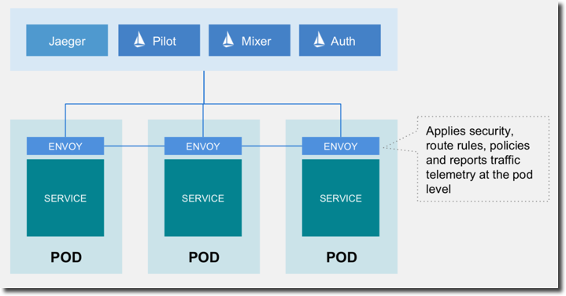

:noaudio:
:scrollbar:
:data-uri:
:toc2:
:linkattrs:

= Deploying Microservices

== Goals

In this lab, you will:

* Access the OpenShift environment
* Deploy microservice applications to OpenShift

== What is a Service Mesh?

As microservices-based applications become more prevalent, both the number of
and complexity of their interactions increases. Up until now much of the burden
of managing these complex microservices interactions has been placed on the
application developer, with different or non-existent support for microservice
concepts depending on language and framework.

The service mesh concept pushes this responsibility to the infrastructure, with
features for traffic management, distributed tracing and observability, policy
enforcement, and service/identity security, freeing the developer to focus on
business value. In this hands-on session you will learn how to apply some of
these features to a simple polyglot microservices application running on top of
OpenShift using Istio, an open platform to connect, manage, and secure
microservices.

== What is Istio?

https://istio.io/[Istio] is an open platform to connect, manage, and secure microservices. Istio
provides an easy way to create a network of deployed services with load
balancing, service-to-service authentication, monitoring, and more, without
requiring any changes in application code. OpenShift can automatically inject a
special sidecar proxy throughout your environment to enable Istio management for
your application. This proxy intercepts all network communication between your
microservices microservices, and is configured and managed using Istio’s control
plane functionality -- not your application code!

== Lab Overview

There are three microservices in this lab. Here is the application architecture:

== OpenShift access

. Open a terminal window 

. Switch to your tutorial project
+
----
oc project $OCP_TUTORIAL_PROJECT
----

== Clone Source Code

Start by cloning the tutorial source files.

. Enter the following commands:
+
----
mkdir ~/lab && cd "$_"

git clone https://github.com/gpe-mw-training/rhte-msa-and-service-mesh.git

cd rhte-msa-and-service-mesh
----

== Deploy Catalog service version 1 (`v1`)

Istio introduces the concept of a service version, which is a finer-grained way to subdivide
service instances by versions (`v1`, `v2`) or environment (`staging`, `prod`). These variants are not
necessarily different API versions: they could be iterative changes to the same service, deployed
in different environments (prod, staging, dev, etc.). Common scenarios where this is used include
A/B testing or canary rollouts. Istio’s https://istio.io/docs/concepts/traffic-management/rules-configuration.html[traffic routing rules] can refer to service versions to
provide additional control over traffic between services.

Now let's start by deploying the catalog service to OpenShift. The sidecar proxy will automatically be injected.

. In your terminal window, build the `catalog` service using the following commands:
+
----
cd catalog/java/vertx
mvn clean package
----

* Expect to see:
+
----
[INFO] Scanning for projects...
[INFO]
[INFO] -----------------< com.redhat.developer.demos:catalog >-----------------
[INFO] Building catalog 1.0.0-SNAPSHOT
[INFO] --------------------------------[ jar ]---------------------------------
...
...
[INFO] ------------------------------------------------------------------------
[INFO] BUILD SUCCESS
[INFO] ------------------------------------------------------------------------
[INFO] Total time: 01:23 min
[INFO] Finished at: 2018-09-08T14:36:10Z
[INFO] ------------------------------------------------------------------------
----

. Create the docker image for the `catalog` service. Also, verify the image is in the local docker repository.
+
----
sudo docker build -t example/catalog:v1 .
sudo docker images | grep example/catalog
----

* Expect to see:
+
----
...
example/catalog         v1       4e6674de4628        40 seconds ago      443 MB
----

. Deploy the `catalog` service and inject the istio sidecar.
+
----
oc apply -f <(istioctl kube-inject -f ../../kubernetes/Deployment.yml) -n $OCP_TUTORIAL_PROJECT
oc create -f ../../kubernetes/Service.yml
----

* Expect to see:
+
----
deployment.extensions "catalog-v1" created
service "catalog" created
----

. Monitor the deployment of the pods. Enter the following command:
+
----
oc get pods -w
----
+
* For the `catalog` service, wait until the Ready column has `2/2` pods and the Status column has `Running`. 

* Expect to see:
+
----
NAME                          READY     STATUS    RESTARTS   AGE
catalog-v1-6b576ffcf8-g6b48   2/2       Running   0          1m
----

* To exit, press Ctrl+C.

Since the `catalog` service is at the end of our service chain (`gateway -> partner -> catalog`), it is not exposed to the outside world.

== Deploy Partner service 

Next, we will deploy the `partner` service to OpenShift. 

. In your terminal window, enter the following commands:
+
----
cd ~/lab/rhte-msa-and-service-mesh

cd partner/java/springboot
mvn clean package
----

* Expect to see:
+
----
[INFO] Scanning for projects...
[INFO]
[INFO] -----------------< com.redhat.developer.demos:partner >-----------------
[INFO] Building partner 0.0.1-SNAPSHOT
[INFO] --------------------------------[ jar ]---------------------------------
...
...
[INFO] ------------------------------------------------------------------------
[INFO] BUILD SUCCESS
[INFO] ------------------------------------------------------------------------
[INFO] Total time: 01:14 min
[INFO] Finished at: 2018-09-06T18:49:10Z
[INFO] ------------------------------------------------------------------------
----

. Create the docker image for the `partner` service. Also, verify the image is in the local docker repository.
+
----
sudo docker build -t example/partner:v1 .
sudo docker images | grep example/partner
----

* Expect to see:
+
----
...
example/partner       v1       2be57b4f5feb        16 seconds ago       459 MB
----

. Deploy the `partner` service and inject the istio sidecar.
+
----
oc apply -f <(istioctl kube-inject -f ../../kubernetes/Deployment.yml) -n $OCP_TUTORIAL_PROJECT
oc create -f ../../kubernetes/Service.yml
----

* Expect to see:
+
----
deployment.extensions "partner-v1" created
service "partner" created
----

. Monitor the deployment of the pods. Enter the following command:
+
----
oc get pods -w
----
+
* For the `partner` service, wait until the Ready column has `2/2` pods and the Status column has `Running`. 

* Expect to see:
+
----
NAME                          READY     STATUS    RESTARTS   AGE
partner-v1-68b4854c79-s5vnd   2/2       Running   0          2m
...
----

* To exit, press Ctrl+C.

== Deploy Gateway service

Finally, we will deploy the gateway service to OpenShift. This will complete our list of services: 

`gateway -> partner -> catalog`

. In your terminal window, build the `gateway` service with the following commands:
+
----
cd ~/lab/rhte-msa-and-service-mesh

cd gateway/java/springboot
mvn clean package
----

* Expect to see:
+
----
[INFO] Scanning for projects...
[INFO]
[INFO] -----------------< com.redhat.developer.demos:gateway >-----------------
[INFO] Building gateway 0.0.1-SNAPSHOT
[INFO] --------------------------------[ jar ]---------------------------------
...
...
[INFO] ------------------------------------------------------------------------
[INFO] BUILD SUCCESS
[INFO] ------------------------------------------------------------------------
[INFO] Total time: 4.658 s
[INFO] Finished at: 2018-09-06T19:20:10Z
[INFO] ------------------------------------------------------------------------
----

. Create the docker image for the `gateway` service. Also, verify the image is in the local docker repository.
+
----
sudo docker build -t example/gateway .
sudo docker images | grep example/gateway
----

* Expect to see:
+
----
...
example/gateway          latest         a08a674ee02c        8 seconds ago       459 MB
----

. Deploy the `gateway` service and inject the istio sidecar.
+
----
oc apply -f <(istioctl kube-inject -f ../../kubernetes/Deployment.yml) -n $OCP_TUTORIAL_PROJECT
oc create -f ../../kubernetes/Service.yml -n $OCP_TUTORIAL_PROJECT
----

* Expect to see:
+
----
deployment.extensions "gateway" created
service "gateway" created
----

. Monitor the deployment of the pods. Enter the following command:
+
----
oc get pods -w
----
+
* For the `gateway` service, wait until the Ready column has `2/2` pods and the Status column has `Running`. 

* Expect to see:
+
----
NAME                          READY     STATUS    RESTARTS   AGE
gateway-7b6bb9dcf7-zb8br      2/2       Running   0          1m
...
----

* To exit, press Ctrl+C.

=== Expose Gateway Service

. Here is the application architecture:
+

. The `gateway` service is the one our users will interact with.
.. Let’s add an OpenShift Route that exposes that endpoint.
+
----
oc expose service gateway
----

. Retrieve the URL for the gateway service
+
----
export GATEWAY_URL=http://$(oc get route gateway -n $OCP_TUTORIAL_PROJECT -o template --template='{{.spec.host}}')

echo $GATEWAY_URL
----

. Test the gateway service
+
----
curl $GATEWAY_URL 
----
+
* You should see the following output
+
----
gateway => partner => catalog v1 from '6b576ffcf8-g6b48': 1
----

== Congratulations!

In this lab you deployed microservices to OpenShift. In the next lab, you will learn how to leverage these microservices in a service mesh with Istio.

Proceed to the next lab: link:02_monitoring_with_kiali_Lab.html[*02 - Service Mesh Monitoring with Kiali*]

== References

* https://istio.io[Istio Homepage]
* https://learn.openshift.com/servicemesh[Learn Istio on OpenShift]
* https://openshift.com[Red Hat OpenShift]