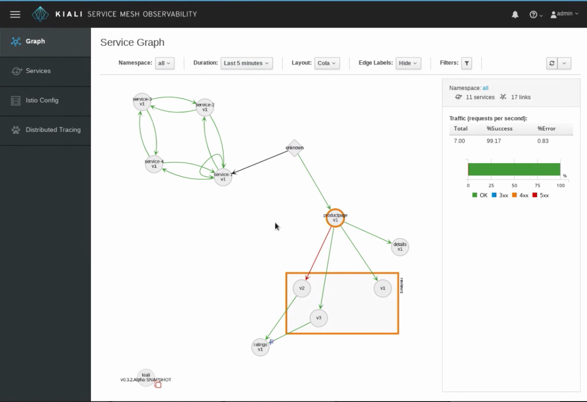
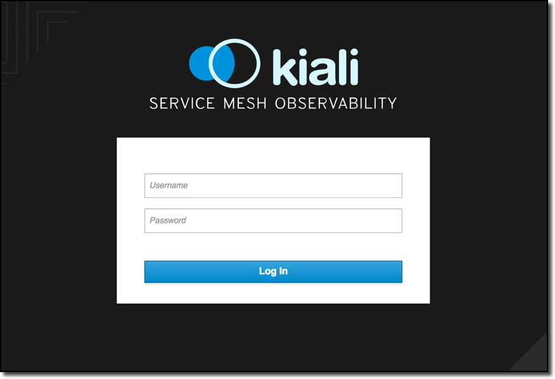
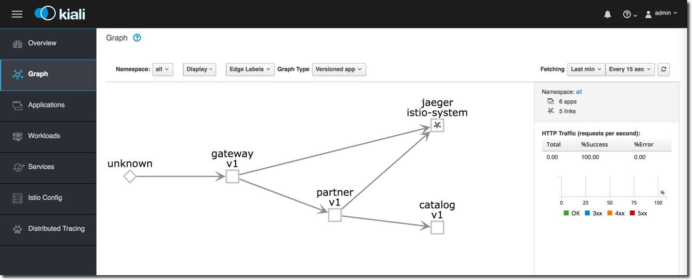
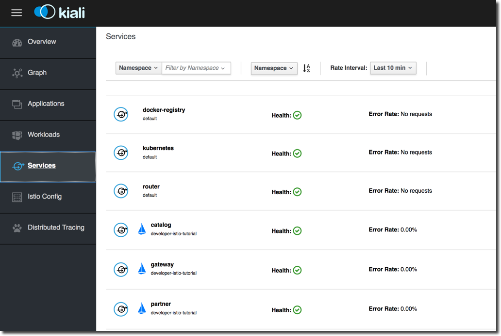
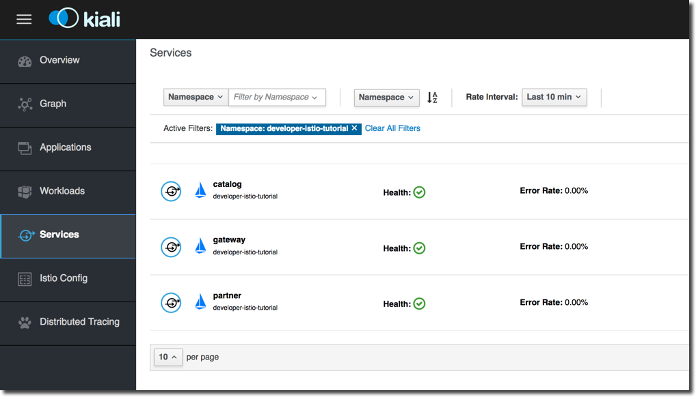
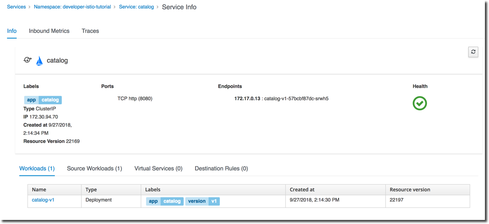
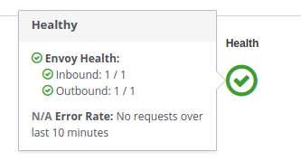
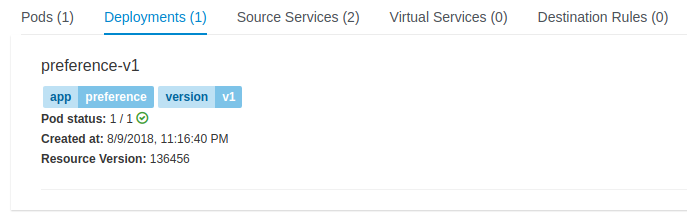
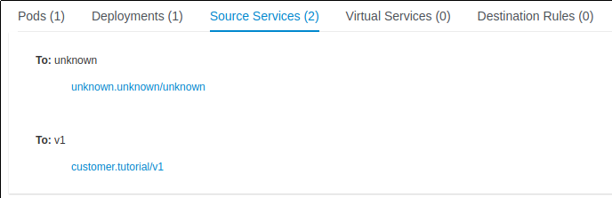
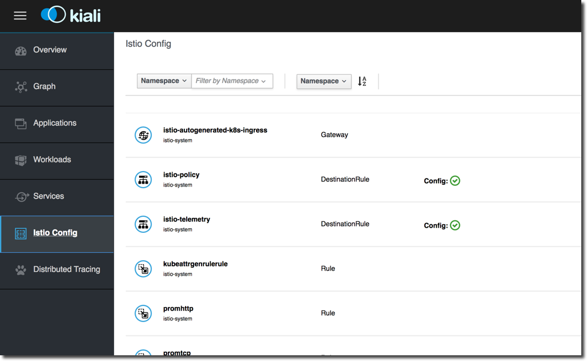

:noaudio:
:scrollbar:
:data-uri:
:toc2:
:linkattrs:

= Service Mesh Monitoring with Kiali

At some point when you are developing your microservice architecture, you will
need to visualize what is happening in your service mesh. You will have
questions like “Which service is connected to which other service?” and “How
much traffic goes to each microservice?” But because of the loosely tied nature
of microservice architectures , these questions can be difficult to answer.

Those are the kinds of question that https://www.kiali.io/[Kiali] has the ability to answer, by giving
you a big picture of the mesh, and showing the whole flow of your requests and
data.

== How does Kiali work?

Kiali taps into the data provided by Istio and OpenShift to generate its
visualizations. It fetches ingress data (such as request tracing with Jaeger),
the listing and data of the services, health indexes, and so on.

Kiali runs as a service together with Istio, and does not require any changes
to Istio or Openshift configuration (besides the ones required to install
Istio).

== Goals

In this lab, you will learn how to:

* Install Kiali
* Monitor your Istio Service Mesh with Kiali

== Install Kiali

. Set up environment variables for Jaeger and Grafana. These environment variables will be used by Kiali during the installation process. We'll talk more about Jaeger and Grafana in later labs.
+
----
export JAEGER_URL=http://$(oc get route tracing -n istio-system -o template --template='{{.spec.host}}')

export GRAFANA_URL=http://$(oc get route grafana -n istio-system -o template --template='{{.spec.host}}')
----

. Install Kiali with the following commands:
+
----
# This command installs Kiali's configmaps
curl https://raw.githubusercontent.com/kiali/kiali/master/deploy/openshift/kiali-configmap.yaml | \
   VERSION_LABEL=master envsubst | oc create -n istio-system -f - --as=system:admin

# This command installs Kiali's secrets
curl https://raw.githubusercontent.com/kiali/kiali/master/deploy/openshift/kiali-secrets.yaml | \
   VERSION_LABEL=master envsubst | oc create -n istio-system -f - --as=system:admin

# And this command installs the Kiali service
curl https://raw.githubusercontent.com/kiali/kiali/master/deploy/openshift/kiali.yaml | \
   IMAGE_NAME=kiali/kiali \
   IMAGE_VERSION=latest \
   NAMESPACE=istio-system \
   VERSION_LABEL=master \
   VERBOSE_MODE=4 envsubst | oc create -n istio-system -f - --as=system:admin
----

. You can use the following commands to see if the service is running:
+
----
oc project istio-system
oc get pods -w
----
+
NOTE: Installing Kiali may take 2 - 5 minutes. During this time, the pod for *kiali-xx-yy* may not initially appear in the list of pods.

* Wait until the status for *kiali-xx-yy* is `Running` and there are `1/1` pods in the
`Ready` column. 

+
----
NAME                                        READY     STATUS      RESTARTS   AGE
grafana-66469c4d95-9n5r4                    1/1       Running     0          10m
istio-citadel-5799b76c66-mw89b              1/1       Running     0          10m
istio-cleanup-secrets-z6clh                 0/1       Completed   0          10m
istio-egressgateway-6578f84b68-hkrwk        1/1       Running     0          10m
istio-galley-5bf4d6b8f7-6ccml               1/1       Running     0          10m
istio-grafana-post-install-xp8rw            0/1       Completed   0          10m
istio-ingressgateway-67995c486c-n7467       1/1       Running     0          10m
istio-pilot-5c778f6dfd-d7lbv                2/2       Running     0          10m
istio-policy-8667975f76-hfthm               2/2       Running     0          10m
istio-sidecar-injector-5b5fcf4df6-rhqp9     1/1       Running     0          10m
istio-statsd-prom-bridge-7f44bb5ddb-9mhb6   1/1       Running     0          10m
istio-telemetry-7d87746bbf-gh8lq            2/2       Running     0          10m
istio-tracing-ff94688bb-pf768               1/1       Running     0          10m
kiali-79f8f8fd5-z4xw8                       1/1       Running     0          14s
prometheus-84bd4b9796-8bbgp                 1/1       Running     0          10m
servicegraph-7875b75b4f-f8s6j               1/1       Running     0          10m
----

. To exit, press `Ctrl+C`.

. View the routes for the project
+ 
----
oc get routes
----

* You'll see a result that's something like this:
+
----
TODO
----

. Enter this command to get the URL of the Kiali web console
+
----
export KIALI_URL=https://$(oc get route kiali -n istio-system -o template --template='{{.spec.host}}')
----

. Display the KIALI_URL
+
----
echo $KIALI_URL
----

. Start a web browser on your computer and vist the URL for $KIALI_URL
+

. At the login screen, enter the default credentials: "admin/admin"

== Service Graph

After you login, you should see the Service Graph page:

It shows a graph with all the microservices, connected by the requests going
through then. On this page, you can see how the services interact with each
other.

== Generating Sample Data

To show the capabilities of Kiali, we need to generate some sample data. For this, we can use our `gateway` application that we deployed earlier.

. Move back to your terminal window

cd ~/lab/rhte-msa-and-service-mesh

. Generate data using the following command:
+
----
scripts/run-all.sh
----

* Let this script continue to run.

== View Animations in the Service Graph

. Move back to the Kiali web console

TODO: show steps to animate the service graph

Add an animated gif of the traffic flow (booyah)

== Service Listing

. Move back to the Kiali web console

. Click the Services link in the left navigation. On the Services page you can
view a listing of all the services that are running in the cluster, and
additional information about them, such as health status.
+

. Click on the "Filter by Namespace" dropdown, and select "tutorial". Then,
you'll see a list of only the services on the tutorial:
+

. Click on the "TODO" to see its details:
+

. By hovering the icon on the Health section, you can see the health of a service
(a service is considered healthy) when it's online and responding to requests
without errors:
+

. You can also see the deployments:
+

. You can also the source services:
+

== Istio Config

The Istio configuration view allow you to browse and validate Istio configuration. The view also provides advanced filtering on navigation through Istio objects. Kiali provides inline config validation for networking objects such as VirtualServices and DestinationRules.

. Click the Istio Config link on the left navigation. On this page, you can see
all currently running config rules, such as Virtual Services, Route Rules,
Routes, Circuit Breakers, Fault Injection and so on.
+

////

== Monitoring with Prometheus and Grafana

Out of the box, you also get additional monitoring via Prometheus and Grafana. 

https://prometheus.io/[Prometheus] is an open-source systems monitoring and alerting toolkit. Prometheus works well for recording any purely numeric time series. It fits both machine-centric monitoring as well as monitoring of highly dynamic service-oriented architectures. In a world of microservices, its support for multi-dimensional data collection and querying is a particular strength.

https://grafana.com/[Grafana] is an open platform for data analysis and visualization. Grafana lets you create graphs and dashboards based on data from various monitoring systems, and it specializes in the display and analysis of this data. It is lightweight, easy to install, and it looks beautiful. In particular, Grafana supports querying Prometheus.

=== Grafana Demo

[source,bash]
----
open "$(minishift openshift service grafana -u)/d/1/istio-dashboard?refresh=5s&orgId=1"
----

image:grafana1.png[alt text]

[source,bash]
----
open "$(minishift openshift service grafana -u)/d/UbsSZTDik/istio-workload-dashboard?refresh=5s&orgId=1"
----

to check the "Workload of the services"

image:grafana2.png[alt text]

[#custommetrics]
=== Prometheus Demo - Custom Metrics

Istio also allows you to specify custom metrics which can be seen inside of the Prometheus dashboard

[source,bash]
----
open "$(minishift openshift service prometheus -u)/graph?g0.range_input=5m&g0.expr=&g0.tab=0"
----

Add the custom metric and rule. First make sure you are in the "istio-tutorial" directory and then

[source,bash]
----
istioctl create -f istiofiles/recommendation_requestcount.yml -n istio-system
----

In the Prometheus dashboard, add the following

[source,bash]
----
istio_requests_total{destination_service="recommendation.tutorial.svc.cluster.local"}
----

and select `Execute`

image:prometheus_custom_metric.png[alt text]

Then run several requests through the system

[source,bash]
----
while true; do curl customer-tutorial.$(minishift ip).nip.io; sleep .5;  done
----

NOTE: You may have to refresh the browser for the Prometheus graph to update. And you may wish to make the interval 5m (5 minutes) as seen in the screenshot above.

////

== Congratulations!

In this lab you learned how to install Kiali. You also learned how to use Kiali for monitoring your Istio service mesh.

Proceed to the next lab: link:03_distributed_tracing_Lab.html[*03 - Distributed Tracing*]

== References

* https://www.kiali.io/[Kiali]
* https://openshift.com[Red Hat OpenShift]
* https://learn.openshift.com/servicemesh[Learn Istio on OpenShift]
* https://istio.io[Istio Homepage]