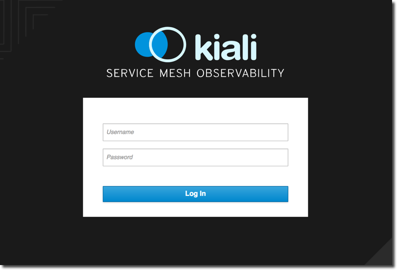

:noaudio:
:scrollbar:
:data-uri:
:toc2:
:linkattrs:

= Service Mesh Monitoring with Kiali

== Goals

In this lab, you will learn how to:

* Install Kiali
* Monitor your Istio Service Mesh with Kiali

== Why Service Mesh Monitoring?

At some point when you are developing your microservice architecture, you will
need to visualize what is happening in your service mesh. You will have
questions like “Which service is connected to which other service?” and “How
much traffic goes to each microservice?” But because of the loosely tied nature
of microservice architectures , these questions can be difficult to answer.

Those are the kinds of question that https://www.kiali.io/[Kiali] has the ability to answer, by giving
you a big picture of the mesh, and showing the whole flow of your requests and
data.

image::images/graph-overview.png[]

== How does Kiali work?

Kiali taps into the data provided by Istio and OpenShift to generate its
visualizations. It fetches ingress data (such as request tracing with Jaeger),
the listing and data of the services, health indexes, and so on.

Kiali runs as a service together with Istio, and does not require any changes
to Istio or Openshift configuration (besides the ones required to install
Istio).

== Install Kiali

. Set up environment variables for Jaeger and Grafana. These environment variables will be used by Kiali during the installation process. We'll talk more about Jaeger and Grafana in later labs.
+
----
export JAEGER_URL=http://$(oc get route tracing -n istio-system -o template --template='{{.spec.host}}')

export GRAFANA_URL=http://$(oc get route grafana -n istio-system -o template --template='{{.spec.host}}')
----

. Install Kiali with the following commands:
+
----
# This command installs Kiali's configmaps
curl https://raw.githubusercontent.com/gpe-mw-training/kiali/v0.9/deploy/openshift/kiali-configmap.yaml | \
   VERSION_LABEL=master envsubst | oc create -n istio-system -f - --as=system:admin

# This command installs Kiali's secrets
curl https://raw.githubusercontent.com/gpe-mw-training/kiali/v0.9/deploy/openshift/kiali-secrets.yaml | \
   VERSION_LABEL=master envsubst | oc create -n istio-system -f - --as=system:admin

# And this command installs the Kiali service
curl https://raw.githubusercontent.com/gpe-mw-training/kiali/v0.9/deploy/openshift/kiali.yaml | \
   IMAGE_NAME=kiali/kiali \
   IMAGE_VERSION=latest \
   NAMESPACE=istio-system \
   VERSION_LABEL=master \
   VERBOSE_MODE=4 envsubst | oc create -n istio-system -f - --as=system:admin
----

. You can use the following commands to see if the service is running:
+
----
oc project istio-system
oc get pods -w
----

* Wait until the status for *kiali-xx-yy* is `Running` and there are `1/1` pods in the
`Ready` column. 

+
----
NAME                                        READY     STATUS      RESTARTS   AGE
grafana-66469c4d95-9n5r4                    1/1       Running     0          10m
istio-citadel-5799b76c66-mw89b              1/1       Running     0          10m
istio-cleanup-secrets-z6clh                 0/1       Completed   0          10m
istio-egressgateway-6578f84b68-hkrwk        1/1       Running     0          10m
istio-galley-5bf4d6b8f7-6ccml               1/1       Running     0          10m
istio-grafana-post-install-xp8rw            0/1       Completed   0          10m
istio-ingressgateway-67995c486c-n7467       1/1       Running     0          10m
istio-pilot-5c778f6dfd-d7lbv                2/2       Running     0          10m
istio-policy-8667975f76-hfthm               2/2       Running     0          10m
istio-sidecar-injector-5b5fcf4df6-rhqp9     1/1       Running     0          10m
istio-statsd-prom-bridge-7f44bb5ddb-9mhb6   1/1       Running     0          10m
istio-telemetry-7d87746bbf-gh8lq            2/2       Running     0          10m
istio-tracing-ff94688bb-pf768               1/1       Running     0          10m
kiali-79f8f8fd5-z4xw8                       1/1       Running     0          14s
prometheus-84bd4b9796-8bbgp                 1/1       Running     0          10m
servicegraph-7875b75b4f-f8s6j               1/1       Running     0          10m
----

. To exit, press `Ctrl+C`.

. View the routes for the project
+ 
----
oc get routes
----

* You'll see a result that's something like this. Make note of the entry for *kiali*
+
----
NAME                   HOST/PORT                                                               PATH      SERVICES               PORT              TERMINATION   WILDCARD
grafana                grafana-istio-system.apps.clientvm.61ea.rhte.opentlc.com                          grafana                http                            None
istio-ingressgateway   istio-ingressgateway-istio-system.apps.clientvm.61ea.rhte.opentlc.com             istio-ingressgateway   http2                           None
kiali                  kiali-istio-system.apps.clientvm.61ea.rhte.opentlc.com                            kiali                  <all>             reencrypt     None
prometheus             prometheus-istio-system.apps.clientvm.61ea.rhte.opentlc.com                       prometheus             http-prometheus                 None
servicegraph           servicegraph-istio-system.apps.clientvm.61ea.rhte.opentlc.com                     servicegraph           http                            None
tracing                tracing-istio-system.apps.clientvm.61ea.rhte.opentlc.com                          tracing                http-query                      None
----

. Enter this command to get the URL of the Kiali web console
+
----
export KIALI_URL=https://$(oc get route kiali -n istio-system -o template --template='{{.spec.host}}')
----

. Display the `KIALI_URL`
+
----
echo $KIALI_URL
----

. Start a web browser on your computer and vist the URL for `$KIALI_URL`
+

. At the login screen, enter the default credentials:
* Username: *admin*
* Password: *admin*

== Generating Sample Data

To show the capabilities of Kiali, we need to generate some sample data. For this, we can use our `gateway` application that we deployed earlier.

. Move back to your terminal window
+
----
cd ~/lab/rhte-msa-and-service-mesh
----

. Generate data using the following command:
+
----
scripts/run-all.sh
----

* Let this script continue to run.

== Service Graph

. Move back to the Kiali web console

. On the left hand panel, click *Graph*.

. Select the *Namespace* drop-down list and choose *developer-istio-tutorial*
+
* This page shows a graph with all the microservices, connected by the requests going
through then. On this page, you can see how the services interact with each
other. You can zoom in/out on this page.
+
image::images/kiali-service-graph.png[]

NOTE: Earlier we deployed microservices for gateway, partner and catalog. Notice how they are connected as `gateway -> partner -> catalog`. At the moment, we only have `v1` versions of the services. In later labs we'll add more versions of the services.

== View Animations in the Service Graph

. In the *Graph* screen, select the *Display* drop-down list

. Check the option for *Traffic Animation*
+

* You should now see traffic animation on the graph. This is based on traffic that is generated by the script you ran earlier: `scripts/run-all.sh`.

== Service Listing

. On the left hand panel, click the *Services* link. 

* On the Services page you can view a listing of all the services that are running in the cluster, and
additional information about them, such as health status.
+
image::images/kiali-service-list.png[]

. Click on the *Filter by Namespace* dropdown, and select *developer-istio-tutorial*. Then,
you'll see a list of only the services for the tutorial:
+

. Click on the *catalog* service to see its details:
+

. Hover over the *Health* icon to view the health of a service
(a service is considered healthy) when it's online and responding to requests
without errors:
+
image::images/kiali-service-health.png[]

. You can also view the Workloads for the catalog service. Select *Workloads > catalog-v1*
* This page shows the pod(s) for the catalog service and associated service.

== Istio Config

The Istio configuration view allow you to browse and validate Istio configuration. The view also provides advanced filtering on navigation through Istio objects. Kiali provides inline config validation for networking objects such as VirtualServices and DestinationRules.

. On the left hand panel, click the *Istio Config* link.

. Clear the namespace filter for *developer-istio-tutorial*

. On this page, you can see all currently running config rules, such as Virtual Services, Route Rules,
Routes, Circuit Breakers, Fault Injection and so on.

image::images/kiali-istio-config.png[]

== Clean Up

. Move back to your terminal window that is running the script.

. Press CTRL+C to stop the script.

== Congratulations!

In this lab you learned how to install Kiali. You also learned how to use Kiali for monitoring your Istio service mesh. We'll use Kiali again in some of the later labs.

Proceed to the next lab: link:03_distributed_tracing_Lab.html[*03 - Distributed Tracing*]

== References

* https://www.kiali.io/[Kiali]
* https://istio.io[Istio Homepage]
* https://learn.openshift.com/servicemesh[Learn Istio on OpenShift]
* https://openshift.com[Red Hat OpenShift]