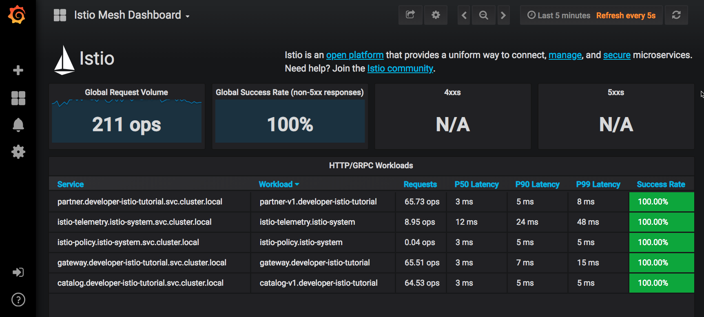

:noaudio:
:scrollbar:
:data-uri:
:toc2:
:linkattrs:

= Distributed Tracing

Distributed Tracing involves propagating the tracing context from service to service, usually done by sending certain incoming HTTP headers downstream to outbound requests. For services embedding a http://opentracing.io/[OpenTracing] framework instrumentations such as https://github.com/opentracing-contrib/java-spring-cloud[opentracing-spring-cloud], this might be transparent. For services that are not embedding OpenTracing libraries, this context propagation needs to be done manually.

https://www.jaegertracing.io/[Jaeger] is an implementation of the OpenTracing specification. Originally from Uber, Red Hat actively contributes to the project.

== How does Distributed Tracking work?

As OpenTracing is "just" an instrumentation library, a concrete tracer is required in order to actually capture the tracing data and report it to a remote server. Our `gateway` and `partner` services ship with Jaeger as the concrete tracer. the Istio platform automatically sends collected tracing data to Jaeger, so that we are able to see a trace involving all three services, even if our `catalog` service is not aware of OpenTracing or Jaeger at all.

Our `gateway` and `partner` services are using the https://github.com/jaegertracing/jaeger-client-java/tree/master/jaeger-tracerresolver[`TracerResolver`] facility from OpenTracing, so that the concrete tracer can be loaded automatically without our code having a hard dependency on Jaeger. Given that the Jaeger tracer can be https://github.com/jaegertracing/jaeger-client-java/blob/master/jaeger-core/README.md#configuration-via-environment[configured via environment variables], we don't need to do anything in order to get a properly configured Jaeger tracer ready and registered with OpenTracing. That said, there are cases where it's appropriate to manually configure a tracer. Refer to the Jaeger documentation for more information on how to do that.

The Jaeger agent is deployed as a sidecar container next to the application component containers. The agent collects tracing data from the applications and transmits them to the Jaeger collector through port 14267.

The Jaeger sidecar runs the Jaeger agent, which acts as a proxy to the Jaeger collector. The agent is a daemon program that runs on every host and receives tracing information submitted by applications via Jaeger client libraries. The agent transmits this information to the Jaeger collector. The Jaeger tracer instance in the application transmits the tracing information to the agent using UDP.

== Key Terms

*Tracing* refers to the logging of system activity. That sounds pretty broad, but in fact, one of the basic rules of tracing is that data are dumped into a tracing data store without regard to formatting. The consumer of the data is responsible for finding and parsing the relevant data. For Istio, Jaeger is the tracing system used; it follows the OpenTracing Data Model.

*Traces* are the end-to-end data that make up a request, or unit of work. For example, from the moment a user clicks the button on the web page until the data are returned, and all the microservices in between. One trace represents (or models) that round trip. In the Jaeger UI, traces are displayed with a time axis. An analogy might be an entire chain, made up of individual links. Traces are made up of one or more spans.

*Spans* are the slices of time represented by the beginning to the end of a unit of work. Using our chain analogy, each span represents a link in the chain. Spans can have zero, one, or many child spans. At the root level, the initial span’s elapsed time will equal the elapsed time of the trace that owns it.

*Monitoring* is the act of watching your system, by a UI and/or automation. Tracing data drives monitoring. Monitoring in Istio is provided by Prometheus and includes a UI. Prometheus supports automated monitoring via Alerts and Alert Managers.

== Goals

In this lab, you use Jaeger to trace calls for our microservices. 

== Add Tracing Support

To implement tracing, the application needs to create a collection of “Spans”. Those “Spans” will be exported to Jaeger, so it can create the visualization of the tracing. A “Span” marks, among other data, an operation name, a start timestamp, a finish timestamp. The propagation of the “Span” is done by forwarding Jaeger specific HTTP Request Headers from inbound requests to outbound requests. Depending on your development language and/or your approach, this may require a small modification to your source code. 

. Using a text editor, view the code for the `GatewayController.java`
+
----
cd ~/lab/rhte-msa-service-mesh/gateway/java/springboot/src/main/java

vi com/redhat/developer/demos/gateway/GatewayController.java
----

. The following Java code, using Spring Boot, gives an example of adding an OpenTracer to your application.
+
----
@RestController
public class GatewayController {

	...

    @Autowired
    private Tracer tracer;

    ...
}
----

* Our `GatewayController` service is using the https://github.com/jaegertracing/jaeger-client-java/tree/master/jaeger-tracerresolver[`TracerResolver`] facility from OpenTracing, so that the concrete tracer can be loaded automatically without our code having a hard dependency on Jaeger. Given that the Jaeger tracer can be https://github.com/jaegertracing/jaeger-client-java/blob/master/jaeger-core/README.md#configuration-via-environment[configured via environment variables], we don't need to do anything in order to get a properly configured Jaeger tracer ready and registered with OpenTracing. 

. In the request mapping for the REST controller, we get the active span and add the user agent to the payload. We'll use the user-agent in some of the later labs to direct traffic based on the header:
+
----
    @RequestMapping("/")
    public ResponseEntity<String> getGateway(@RequestHeader("User-Agent") String userAgent) {
        try {
            /**
             * Set baggage
             */
            tracer.activeSpan().setBaggageItem("user-agent", userAgent);

            ...

        }
        ...
     }
----

. Since we are using Java there is a no-code approach that simply requires a few lines added to your Maven POM file and setting some environment variables. These lines added to your POM.XML file will inject the Jaeger Tracer Resolver.
+
----
        <dependency>
            <groupId>io.jaegertracing</groupId>
            <artifactId>jaeger-tracerresolver</artifactId>
            <version>0.29.0</version>
        </dependency>
----

. In the Docker build configuration file (Dockerfile), the environment variables are set. 
* Docker file location: `~/lab/rhte-msa-service-mesh/gateway/java/springboot/Docker`
+
----
FROM fabric8/java-jboss-openjdk8-jdk:1.3.1
ENV JAVA_APP_DIR=/deployments
ENV JAEGER_SERVICE_NAME=gateway\
  JAEGER_ENDPOINT=http://jaeger-collector.istio-system.svc:14268/api/traces\
  JAEGER_PROPAGATION=b3\
  JAEGER_SAMPLER_TYPE=const\
  JAEGER_SAMPLER_PARAM=1
EXPOSE 8080 8778 9779
COPY target/gateway.jar /deployments/
----

== Viewing Dashboards in Grafana

Out of the box, you also get additional monitoring via Prometheus and Grafana. 

https://prometheus.io/[Prometheus] is an open-source systems monitoring and alerting toolkit. Prometheus works well for recording any purely numeric time series. It fits both machine-centric monitoring as well as monitoring of highly dynamic service-oriented architectures. In a world of microservices, its support for multi-dimensional data collection and querying is a particular strength.

https://grafana.com/[Grafana] is an open platform for data analysis and visualization. Grafana lets you create graphs and dashboards based on data from various monitoring systems, and it specializes in the display and analysis of this data. It is lightweight, easy to install, and it looks beautiful. In particular, Grafana supports querying Prometheus.

A simple dashboard, built using Grafana, is included with your Istio installation.

. Make sure the Grafana URL is still set as an environment variable
+
----
echo $GRAFANA_URL
----

* If the Grafana URL is not set, you can use the following command
+
----
export GRAFANA_URL=http://$(oc get route grafana -n istio-system -o template --template='{{.spec.host}}')
----

. Add a simple dashboard URL
+
----
export GRAFANA_SIMPLE_DASHBOARD_URL="$GRAFANA_URL/d/1/istio-dashboard"

echo $GRAFANA_SIMPLE_DASHBOARD_URL
----

. Start a web browser on your computer and vist the URL for `GRAFANA_SIMPLE_DASHBOARD_URL`

* The Grafana Istio dashboard gives you quick insight into how your system is doing. Here’s a screen capture of just a small part of the dashboard. At the moment, no requests are being generated.

== Generating Sample Data

To show the capabilities of Grafana, we need to generate some sample data. For this, we can use our `gateway` application that we deployed earlier.

. Move back to your terminal window
+
----
cd ~/lab/rhte-msa-and-service-mesh
----

. Generate data using the following command:
+
----
scripts/run-all.sh
----

* Let this script continue to run.

== Drill-Down into the Grafana Dashboard

. Move back to the Grafana web console

* You should now see new metrics in the Grafana dashboard.

* The information available on the Grafana dashboard includes a Dashboard Row with high-level metrics (e.g. Global Request Volume, success rates, 4xx errors), a Server Mesh view with charts for each service, and a Services row with details about each container for each service.

. From the list of services, select the `partner` service.
+

* This will show the detailed metrics for the `partner` service.

== Stop the Script

. Move back to your terminal window that is running the script.

. Press CTRL+C to stop the script.

== View Distributed Tracing in the Jaeger Console

With the proper tracing in place, Istio’s out-of-the-box experience allows us to dive deeper into our system’s performance. Using the Jaeger UI, we can view traces, see how far and deep they go, and get an idea of where performance might be lagging.

. Make sure the Jaeger URL is still set as an environment variable
+
----
echo $JAEGER_URL
----

* If the Grafana URL is not set, you can use the following command
+
----
export JAEGER_URL=http://$(oc get route tracing -n istio-system -o template --template='{{.spec.host}}')
----

. Start a web browser on your computer and vist the URL for `JAEGER_URL`

* The Jaeger console gives you quick insight into how your system is doing. 

. In the left hand panel, in the *Services* dropdown list, select `gateway`.
+

. Then click the *Find Traces* button at the bottom left of the panel.

* This will show you all of the traces for the `gateway` service. The trace data was collected earlier when we ran the script to access the `gateway` service: `run-all.sh`.
+

+
. For the `gateway` service, select the most recent trace in the list.
+

. Review the details of this trace.
+

* Examining this trace, we can see:
** Nine spans.
** A total elapsed time of 4.45ms _(your actual times may vary)_.
** A total of three services: `gateway > partner > catalog`
** The last service in the chain, `catalog`, took .69ms.

* This type of graph gives you a visible understanding how just one underperforming service in a chain can hobble your entire system.

This is just scratching the surface.  Grafana and Jaeger have depths of information that can fill books. This lab exercise was simply intended to get you headed in the right direction and to let you know what is possible using Istio.

== Congratulations!

In this lab you learned how to use Grafana to view metrics for our microservics. You also used Jaeger to view traces and see how far and deep the microservice calls go.

Proceed to the next lab: link:04_route_rules_Lab.html[*04 - Dynamic Routing*]

== References
* http://opentracing.io/[OpenTracing Framework]
* https://grafana.com/[Grafana]
* https://www.jaegertracing.io/[Jaeger]
* https://istio.io[Istio Homepage]
* https://learn.openshift.com/servicemesh[Learn Istio on OpenShift]
* https://openshift.com[Red Hat OpenShift]