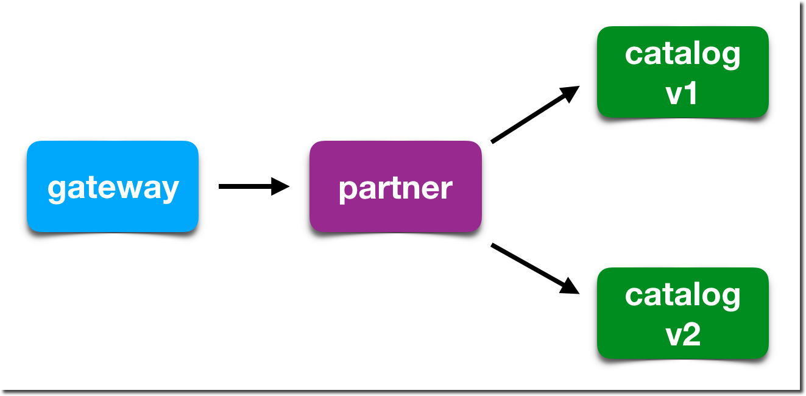

:noaudio:
:scrollbar:
:data-uri:
:toc2:
:linkattrs:

= Dynamic Routing with Istio

== Goals

In this lab, you will learn how to:

* Inject sidecar proxies into applications which form a service mesh
* Configure a service mesh to dynamically route and shape traffic to and from services

== Lab Overview

There are three microservices in this lab and they are chained together in the following sequence:

image::images/app-architecture.png[width="60%"]

In this lab you'll dynamically alter routing between the services using Istio.

== Deploy Catalog service version 2 (`v2`)

We can experiment with Istio routing rules by deploying a second version of the catalog
service.

. Edit Java source code to show v2 message
+
----
cd ~/lab/rhte-msa-and-service-mesh/catalog/java/vertx

vi src/main/java/com/redhat/developer/demos/catalog/CatalogVerticle.java
----

. In the file `CatalogVerticle.java`, update this line to say `v2`
+
----
private static final String RESPONSE_STRING_FORMAT = "catalog v2 from '%s': %d\n";
----

. Save the file and exit vi.

. Build the service with the following commands:
+
----
mvn clean package

sudo docker build -t example/catalog:v2 .
----
+
NOTE: The "v2" tag during the Docker build is significant.

. Deploy Catalog service version 2 
+
----
oc apply -f <(istioctl kube-inject -f ../../kubernetes/Deployment-v2.yml) -n $OCP_TUTORIAL_PROJECT
----
+
* This second deployment file `Deployment-v2.yml` will label the service correctly.

. You can see both versions of the `catalog` pods running with the following command:
+
----
oc project $OCP_TUTORIAL_PROJECT

oc get pods -l app=catalog -w
----
+
* For the `catalog-v2` service, wait until the Ready column has `2/2` pods and the Status column has `Running`. 

* You should see:
+
----
NAME                          READY     STATUS    RESTARTS   AGE
catalog-v1-6b576ffcf8-g6b48   2/2       Running   0          31m
catalog-v2-7764964564-hj8xl   2/2       Running   0          49s
----
+

* To exit, press Ctrl+C.

* By default, Istio will round-robin incoming requests to the `catalog` Service
so that both `v1` and `v2` pods get equal amounts of traffic.

== Set up Multiple Terminal Windows

In order to help with testing our application and monitoring the service mesh, we'll set up multiple terminal windows. We'll have two terminal windows:

* Terminal 1: Running our oc commands
* Terminal 2: Running request scripts

Let's do some prep work before setting up our terminals

. Move to your original terminal window and enter the following commands.
+
----
echo "export KIALI_URL=https://$(oc get route kiali -n istio-system -o template --template='{{.spec.host}}')
" >> ~/.bashrc

echo "export GATEWAY_URL=http://$(oc get route gateway -n $OCP_TUTORIAL_PROJECT -o template --template='{{.spec.host}}')" >> ~/.bashrc

source ~/.bashrc
----

. Open a *new* terminal window on your computer. 

.. ssh into your VM with the following command:
+
----
export OCP_REGION=<<YOUR-GUID-GRABBER-NUMBER>>

ssh lab-user@bastion.${OCP_REGION}.rhte.opentlc.com
----
* When prompted for password, enter: `r3dh4t1!`

* We will refer to this new terminal as *Terminal #2*.

== Test the Gateway service

. Move to your new terminal, *Terminal #2*
. Now let's send some requests to the gateway service
+
----
curl $GATEWAY_URL
----

* You will likely see:
+
----
gateway => partner => catalog v1 from '6b576ffcf8-g6b48': 2
----
+
* Where `6b576ffcf8-g6b48` is the pod running `v1` and the `2` is the number of times you hit the endpoint.

. Make another request to the gateway service
+
----
curl $GATEWAY_URL
----

* You will likely see:
+
----
gateway => partner => catalog v2 from '7764964564-hj8xl': 1
----
+
* Where `7764964564-hj8xl` is the pod running `v2` and the `1` is basically the number of times you hit the endpoint.

* By default you get round-robin load-balancing when there is more than one Pod behind a Service

. Send severals to the `gateway` service. 
+
----
~/lab/rhte-msa-and-service-mesh/scripts/run-all.sh
----
+
* You should see:
+
----
gateway => partner => catalog v1 from '6b576ffcf8-g6b48': 4
gateway => partner => catalog v2 from '7764964564-hj8xl': 3
gateway => partner => catalog v1 from '6b576ffcf8-g6b48': 5
gateway => partner => catalog v2 from '7764964564-hj8xl': 4
gateway => partner => catalog v1 from '6b576ffcf8-g6b48': 6
gateway => partner => catalog v2 from '7764964564-hj8xl': 5
gateway => partner => catalog v1 from '6b576ffcf8-g6b48': 7
gateway => partner => catalog v2 from '7764964564-hj8xl': 6
gateway => partner => catalog v1 from '6b576ffcf8-g6b48': 8
gateway => partner => catalog v2 from '7764964564-hj8xl': 7
...
----

* Let this script continue to run.

== Observe Service Mesh Traffic with Kiali

. Move to your original terminal windows (*Terminal #1*)

. Display the `KIALI_URL`
+
----
echo $KIALI_URL
----

. Start a web browser on your computer and vist the URL for `$KIALI_URL`
+
image::images/kiali-login.png[width="50%"]

. At the login screen, enter the default credentials:
* Username: *admin*
* Password: *admin*

. In the left hand panel, click the *Graph* link

. In the *Graph* screen, select the *Display* drop-down list
.. Check the option for *Traffic Animation*

* You should now see traffic animation on the graph.

. Select the *Edge Labels* drop-down list
.. Select the option for *Requests percent of total*

* Confirm that half of the requests go to `catalog-v1` and the other half to `catalog-v2`.

* The default Kubernetes/OpenShift behavior is to round-robin load-balance across all
available pods behind a single Service. 

////
== Scale up the pods for Catalog Service

Now let's see how traffic is routed if we add multiple pods for a given service version.

. Move back to *Terminal #1* and scale up the number of pods for the `catalog-v2` pod:
+
----
oc scale --replicas=2 deployment/catalog-v2
----

. Monitor the scaling up of the new pod
+
----
oc get pods -l app=catalog -w
----
+
* Wait until you see two entries for the `catalog-v2` service. Also wait until the Ready column has `2/2` pods and the Status column has `Running`. 

* You should see:
+
----
NAME                          READY     STATUS    RESTARTS   AGE
catalog-v1-6b576ffcf8-g6b48   2/2       Running   0          31m
catalog-v2-7764964564-hj8xl   2/2       Running   0          10m
catalog-v2-7764964564-d8qwp   2/2       Running   0          49s
----
+

* To exit, press Ctrl+C.

. Move back to the Kiali web console

* Notice that *double* the number of requests are sent to `catalog-v2` than for `catalog-v1`:
+

. Move back to *Terminal #1* and scale back to a single pod for the `catalog-v2` deployment:
+
----
oc scale --replicas=1 deployment/catalog-v2
----

. View the Kiali web console and confirm that the requests are split evenly between `v1` and `v2`.

NOTE: It will take a while for traffic to stabilize. You can change the refresh options to *Every 5 secs* for more frequent updates.
////

== Send all traffic to `catalog:v2`

_Route rules_ control how requests are routed within an Istio service mesh.

Requests can be routed based on the source and destination, HTTP header fields, and weights associated with individual service versions. For example, a route rule could route requests to different versions of a service.

In addition to the usual OpenShift object types like `BuildConfig`, `DeploymentConfig`,
`Service` and `Route`, you also have new object types installed as part of Istio like `RouteRule`. Adding these objects to the running OpenShift cluster is how you configure routing rules for Istio.

`DestinationRule` defines policies that apply to traffic intended for a service after routing has occurred. These rules specify configuration for load balancing, connection pool size from the sidecar, and outlier detection settings to detect and evict unhealthy hosts from the load balancing pool.

A `VirtualService` defines a set of traffic routing rules to apply when a host is addressed. Each routing rule defines matching criteria for traffic of a specific protocol. If the traffic is matched, then it is sent to a named destination service (or subset/version of it) defined in the registry. The source of traffic can also be matched in a routing rule. This allows routing to be customized for specific client contexts.

. Below is an istio configuration file to route all traffic to `v2`. 

* File name: `istiofiles/virtual-service-catalog-v2.yml`
+
----
apiVersion: networking.istio.io/v1alpha3
kind: VirtualService
metadata:
  name: catalog
spec:
  hosts:
  - catalog
  http:
  - route:
    - destination:
        host: catalog 
        subset: version-v2 
      weight: 100 
---
----

** This definition allows you to configure a percentage of traffic and direct it to a specific version of the `catalog` service. In this case, 100% of traffic _(weight)_ for the catalog service will always go to pods matching the labels version: `v2`. 

** The selection of pods here is very similar to the Kubernetes selector model for matching based on labels. So, any service within the service mesh that tries to communicate with the `catalog` service will always be routed to `v2` of the `catalog` service.

. Route all traffic to `v2` using the configuration file.

.. Move back to *Terminal #1* and enter the following commands:
+
----
cd ~/lab/rhte-msa-and-service-mesh

oc create -f istiofiles/destination-rule-catalog-v1-v2.yml -n $OCP_TUTORIAL_PROJECT --as=system:admin

oc create -f istiofiles/virtual-service-catalog-v2.yml -n $OCP_TUTORIAL_PROJECT --as=system:admin
----
+
NOTE: Your OCP user has been provided with the ability to impersonate the system:admin user so as to execute this command. Please use this capability with caution. In a real-world setting, you would have coordinated with a team-member who does with cluster admin rights to execute this command for you. 

. View the Kiali web console and confirm that all requests are being routed to
`catalog:v2`.

NOTE: It will take a while for traffic to stabilize.

== Send all traffic to `catalog:v1`

. Now let's switch this over to v1. We'll use the following configuration. 

* File name: `istiofiles/virtual-service-catalog-v1.yml`
+
----
apiVersion: networking.istio.io/v1alpha3
kind: VirtualService
metadata:
  name: catalog
spec:
  hosts:
  - catalog
  http:
  - route:
    - destination:
        host: catalog 
        subset: version-v1 
      weight: 100 
---
----
* Make note of the weight set to 100 for catalog v1.

* Now let's move everyone to catalog service `v1`.

. In *Terminal #1*, enter the following commands:
+
----
oc replace -f istiofiles/virtual-service-catalog-v1.yml -n $OCP_TUTORIAL_PROJECT --as=system:admin
----
+
NOTE: We use `oc replace` instead of `oc create` since we are overlaying the previous rule

. View the Kiali web console and confirm that all requests are being routed to
`catalog:v1`.
+

. Remove the route rules to get back to default round-robin distribution
of requests.
+
----
oc delete -f istiofiles/virtual-service-catalog-v1.yml -n $OCP_TUTORIAL_PROJECT --as=system:admin
----

* View the Kiali web console and confirm that traffic is equally split once again between `v1` and `v2`.

== Use a Canary Deployment to slowly rollout `v2`

Canary Deployment scenario: push v2 into the cluster but slowly send end-user traffic to it, if you continue to see success, continue shifting more traffic over time.

. Below is an istio configuration file for use in a canary deployment. 

* File name: `istiofiles/virtual-service-catalog-v1_and_v2_70_30.yml`
+
----
apiVersion: networking.istio.io/v1alpha3
kind: VirtualService
metadata:
  creationTimestamp: null
  name: catalog
spec:
  hosts:
  - catalog
  http:
  - route:
    - destination:
        host: catalog
        subset: version-v1
      weight: 70
    - destination:
        host: catalog
        subset: version-v2
      weight: 30
---
----

** This definition allows you to configure a percentage of traffic and direct it to a specific version of the `catalog` service. In this case, 70% of traffic _(weight)_ for the catalog service will go to pods matching the labels version: `v1`. The remaining 30% of traffic will be routed to `v2` of the `catalog` service.

. Create the virtualservice that will send 70% of requests to v1 and 30% to v2.

.. In *Terminal #1*, enter the following command:
+
----
oc create -f istiofiles/virtual-service-catalog-v1_and_v2_70_30.yml -n $OCP_TUTORIAL_PROJECT --as=system:admin
----

. View the Kiali web console. Over time you will see approximately 70% going to `v1`. You should see approximately 30% going to `v2`. This process can be continued (and automated), slowly migrating
traffic over to the new version as it proves its worth in production over time.
+
NOTE: It will take a while for traffic to stabilize.
+

////

. Now let's shift the traffic to 40% to v1 and 60% to v2.
+
----
oc replace -f istiofiles/virtual-service-catalog-v1_and_v2_40_60.yml -n $OCP_TUTORIAL_PROJECT --as=system:admin
----

. View the Kiali web console and confirm the traffic results: 40% to v1 and 60% to v2.
+

. And shift the traffic to 10% to v1 and 90% to v2.
+
----
oc replace -f istiofiles/virtual-service-catalog-v1_and_v2_10_90.yml -n $OCP_TUTORIAL_PROJECT --as=system:admin
----

. View the Kiali web console and confirm the traffic results: 10% to v1 and 90% to v2.
+

////

. Finally, let's move everything over to v2.
+
----
oc replace -f istiofiles/virtual-service-catalog-v2.yml -n $OCP_TUTORIAL_PROJECT --as=system:admin
----

. View the Kiali web console and confirm the traffic results: 100% to v2.
+

== Smart Routing based on User-Agent

You’ve seen how you can use Istio to do fine-grained routing based on service metadata. You also can use Istio to do routing based on request-level metadata.

For example, you can use matching predicates to set up specific route rules based on requests that match a specified set of criteria. For example, you might want to split traffic to a particular service based on geography, mobile device, or browser. Let’s see how to do that with Istio.

In this example, we'll split traffic based on the browser user-agent.

The "user-agent" header is added to OpenTracing baggage in the Gateway service. This is accomplished with the following code:

* File name: `src/com/redhat/developer/demos/gateway/GatewayController.java`
+
----
    @RequestMapping("/")
    public ResponseEntity<String> getGateway(@RequestHeader("User-Agent") String userAgent) {

            /**
             * Set baggage
             */
            tracer.activeSpan().setBaggageItem("user-agent", userAgent);

            ResponseEntity<String> responseEntity = restTemplate.getForEntity(remoteURL, String.class);
            String response = responseEntity.getBody();
            return ResponseEntity.ok(String.format(RESPONSE_STRING_FORMAT, response.trim()));
            ...
    }
----

From there the user-agent header is automatically propagated to all downstream services. To enable automatic baggage propagation all intermediate services have to be instrumented with OpenTracing. The baggage header for user agent has following form `baggage-user-agent: <value>`.

. We can configure Istio to send Safari users to `catalog:v2`. Below is the configuration file.

* File name: `virtual-service-safari-catalog-v2.yml`
+
----
apiVersion: networking.istio.io/v1alpha3
kind: VirtualService
metadata:
  creationTimestamp: null
  name: catalog
spec:
  hosts:
  - catalog
  http:
  - match:
    - headers:
        baggage-user-agent:
          regex: .*Safari.*
    route:
    - destination:
        host: catalog
        subset: version-v2
  - route:
    - destination:
        host: catalog
        subset: version-v1
---
----
* This definition performs a match on http headers for `baggage-user-agent`. It makes use of a regular expression to match on the string `Safari`. If there is a match then the traffic is routed to `catalog:v2`. Else, all other traffic is routed to `catalog:v1`.

. Set Safari users to use `catalog:v2`

.. In *Terminal #1*, enter the following command:
+
----
oc replace -f istiofiles/virtual-service-safari-catalog-v2.yml -n $OCP_TUTORIAL_PROJECT --as=system:admin
----

. Move to *Terminal #2* where your script is running.

.. Press CTRL+C to stop the script

. In *Terminal #2*, test the app using a Safari user agent.
+
----
curl -A Safari $GATEWAY_URL
----

* You should see this request being handled by `catalog:v2`
+
----
gateway => partner => catalog v2 from '7d66bdd7d7-zl7ls': 56
----

. Now test the app using a Firefox user agent.
+
----
curl -A Firefox $GATEWAY_URL
----

* You should see this request being handled by `catalog:v1`
+
----
gateway => partner => catalog v1 from '57bcbf87dc-7zpmm': 174
----

== Clean Up

. In *Terminal #1*, remove the route rules before moving on:
+
----
~/lab/rhte-msa-and-service-mesh/scripts/clean.sh $OCP_TUTORIAL_PROJECT
----

== Congratulations!

In this lab you learned how to deploy microservices to form a _service mesh_ using Istio.
You also learned how to do traffic shaping and routing using _Route Rules_ which instruct
the Istio sidecar proxies to distribute traffic according to specified policy.

Proceed to the next lab: link:05_circuit_breaker_Lab.html[*05 - Circuit Breaker*]

== References

* https://www.kiali.io/[Kiali]
* https://istio.io[Istio Homepage]
* https://learn.openshift.com/servicemesh[Learn Istio on OpenShift]
* https://openshift.com[Red Hat OpenShift]